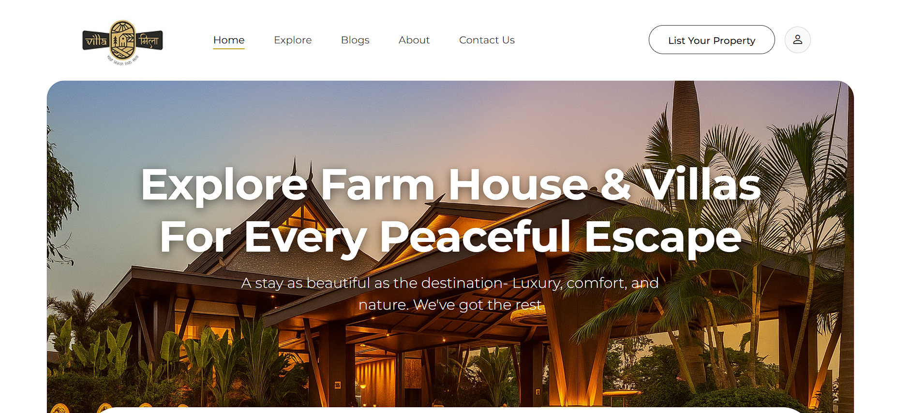
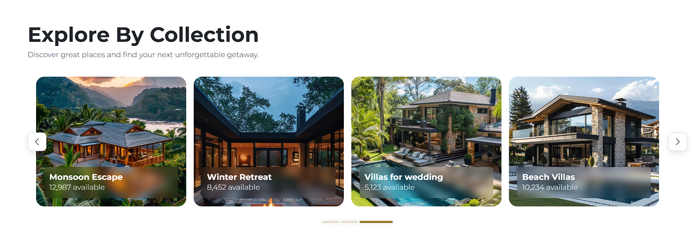
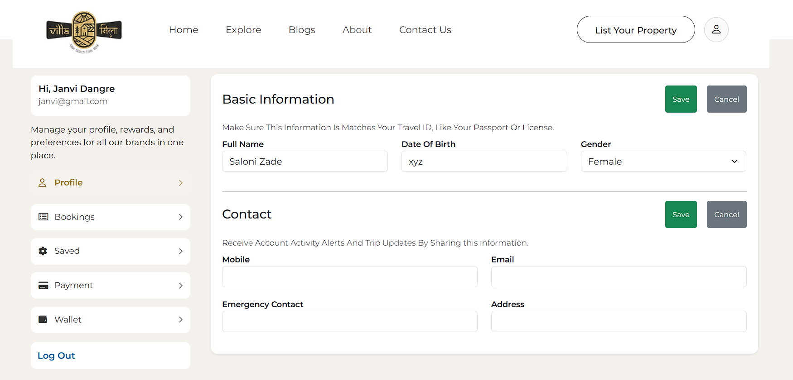

# 🏡 VillaMilaPro

A modern full-stack web application for exploring and booking luxury villas.  
Built with an Angular frontend and a Python backend, this project delivers a smooth and responsive user experience for villa browsing and management.

---

## 🚀 Features

- 🏠 Browse luxury villas with detailed descriptions  
- 🔍 Search and filter villas  
- 📸 Image galleries for each property  
- 🧾 Contact / inquiry form  
- 🔐 Backend API integration  
- 📱 Fully responsive design  

---

## 🛠️ Tech Stack

### Frontend
- Angular  
- TypeScript  
- HTML5, CSS3  

### Backend
- Python (Django / Flask)  
- REST APIs  
 

---

## 📁 Project Structure

